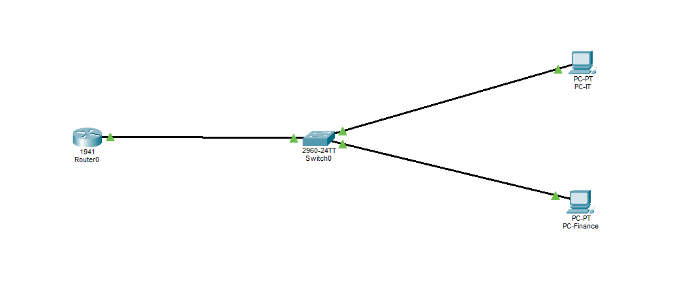

# Lab Scenario: Inter-VLAN Routing (Router-on-a-Stick)

## 1. Topology Overview
The goal of this lab is to establish communication between two departments: **Finance (VLAN 10)** and **Information Technology (VLAN 20)**. Since these departments reside in different broadcast domains, a Layer 3 device (Router) is required to route traffic between them.

 *(Note: Ensure your image file is named topology-diagram.png)*

## 2. Objectives
- Design and implement a VLAN-based network segmentation.
- Configure IEEE 802.1Q trunking between the Switch and the Router.
- Configure logical sub-interfaces on a single physical router port.
- Validate end-to-end connectivity between different VLANs.

## 3. Addressing Table

| Device | Interface | IP Address | Subnet Mask | Default Gateway | VLAN |
| :--- | :--- | :--- | :--- | :--- | :--- |
| **R1** | G0/0.10 | 192.168.10.1 | 255.255.255.0 | N/A | 10 |
| **R1** | G0/0.20 | 192.168.20.1 | 255.255.255.0 | N/A | 20 |
| **S1** | VLAN 1 (Mgmt) | 192.168.1.2 | 255.255.255.0 | 192.168.1.1 | 1 |
| **PC-Finance** | NIC | 192.168.10.10 | 255.255.255.0 | 192.168.10.1 | 10 |
| **PC-IT** | NIC | 192.168.20.10 | 255.255.255.0 | 192.168.20.1 | 20 |

## 4. Configuration Steps

### Part 1: Switch Configuration
1. Create VLANs 10 and 20.
2. Assign access ports (Fa0/1 and Fa0/2) to their respective VLANs.
3. Configure the uplink port (Fa0/24) as a **Trunk** port to allow tagged traffic to reach the router.

### Part 2: Router Configuration
1. Enable the physical interface (GigabitEthernet 0/0) using the `no shutdown` command.
2. Create logical sub-interfaces for each VLAN (G0/0.10 and G0/0.20).
3. Assign **802.1Q encapsulation** and the correct IP Address as the gateway for each VLAN.

## 5. Verification
The following commands were used to verify the configuration:
- `show ip route`: Confirmed that the router sees both networks as "directly connected" via sub-interfaces.
- `show vlan brief`: Verified that ports on the switch are assigned to the correct VLANs.
- `ping`: Tested connectivity from PC-Finance to PC-IT.

## 6. Expected Results
- PC-Finance should be able to ping its gateway (192.168.10.1).
- PC-Finance should be able to ping PC-IT (192.168.20.10).
- The first packet of an inter-VLAN ping may time out due to the ARP process, followed by successful replies.
